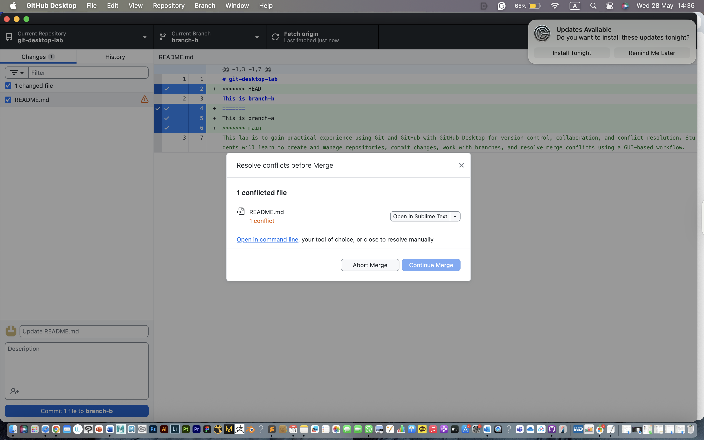
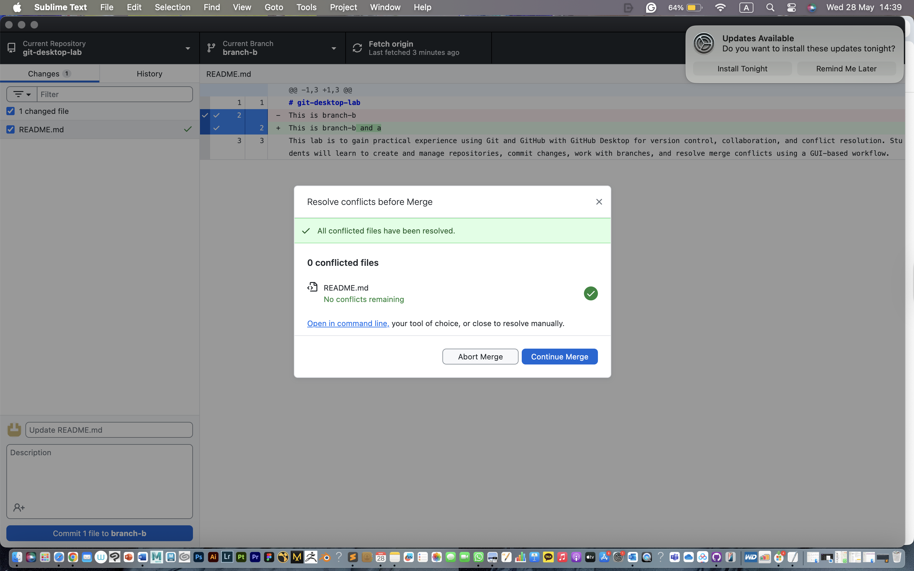

# git-desktop-lab

This is branch-b and a
This lab is to gain practical experience using Git and GitHub with GitHub Desktop for version control, collaboration, and conflict resolution. Students will learn to create and manage repositories, commit changes, work with branches, and resolve merge conflicts using a GUI-based workflow.

# Git Desktop Lab

This repository documents the steps and learnings from the GitHub Desktop lab. The lab covered key Git operations including repository setup, branching, merging, and resolving merge conflicts using GitHub Desktop.

# Repository Setup

Created a new repository** named `git-desktop-lab` on GitHub.
Initialized the repository with a README file.
Cloned the repository to the local machine using GitHub Desktop.

Purpose: To set up a local development environment and connect it to a remote repository.  
Challenge: None.

# Basic Git Operations

Created `info.txt` containing personal details like name, student ID, and course.
Updated `README.md` with a brief description of the lab and its goals.
Committed both files with descriptive messages.
Pushed the changes to GitHub.

Purpose: To practice file creation, staging, committing, and syncing local changes with the remote repository.  
Challenge: None.

# Branching and Merging

Created a branch named `feature/new-content`.
Added `content.txt` with a short paragraph about a favorite topic.
Committed and pushed the new file to the branch.
Created a pull request to merge `feature/new-content` into `main`.
Merged the pull request on GitHub.
Pulled the updated `main` branch to local.

Purpose: To understand feature branching, collaborative workflows, and how to merge features into the main branch.  
Challenge: All steps completed successfully.

# Merge Conflict Resolution

Created two branches**: `branch-a` and `branch-b` from `main`.
In `branch-a`, edited a line in `README.md`** and added "This is branch A". Committed the change.
In `branch-b`, edited the same line** and added "This is branch B". Committed the change.
Merged `branch-a` into `main`** using a pull request.
In GitHub Desktop, switched to `branch-b` and pulled changes from `main`, which caused a merge conflict.
Resolved the conflict in GitHub Desktop using the built-in conflict editor.
Committed** the resolved conflict and pushed the changes to GitHub.
Created and merged a pull request** for `branch-b` into `main`.

Purpose: To simulate and resolve a real-world merge conflict scenario.  
Challenge: Initially confusing, but the conflict editor made it easier to understand and resolve the issue correctly.

# Screenshot: Merge Conflict Resolution

# Summary

This lab walked me through the main steps of using GitHub Desktop, from setting up a repository to resolving a merge conflict. I learned how to commit and push files, work with branches, and merge changes. The most important part was practicing how to handle merge conflicts. At first, it was a bit confusing, but after going through the steps and using the conflict editor, I understood how to fix the problem. Overall, this lab helped me feel more confident using GitHub for version control and made the process of managing and resolving conflicts feel more approachable.

